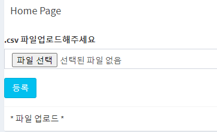

# django

2020-09-21 ~ 09-23

[학습내용]

모델에서 Bbs클래스라는 데이터베이스 테이블을 생성한 뒤 관리자페이지에서 이 테이블에 데이터를 추가하고 데이터를 모델에서 view로 옮겨 templates에 있는 html을 통해 출력해서 보여주는 활동을 했다.

게시판의 글을 몇명이 봤는지에 대한 viewcnt와 TITLE 제목에 url을 연결하여 게시판의 내용을 볼 수 있게하고 마지막으로 게시판을 쓴 작성자가 게시글이 마음에 들지 않을때 삭제 할 수 있게 만들어주는 버튼을 생성하는 하는 내용을 배웠다.

자기가 쓴 게시글에 대해 수정이 가능하도록 update 모델을 만들어 사용했다.

BoardList 작성해서 search Board가  가능하게 만들어주는 작업을 했다. 검색을 통해 게시판 목록을 찾을수 있게 만드는 작업을 했다. 

csv -> model로 작업하는 방법

django - 파일 업로드(.csv)

------------------------------------------------------------------------------


__새로운 App 만들기__

python manage.py starApp BbsApp

[diangoWEB]

__diagoWEB.urls__ 에서 PATH를 입력하여 연결해 주어야 한다.

```python
from django.contrib import admin
from django.urls import path, include

urlpatterns = [
    path('admin/', admin.site.urls),
    path('hello/', include('helloApp.urls')),
    path('polls/', include('PollsApp.urls')),
    path('bbs/', include('BbsApp.urls')) # 새로 추가된 어플
    # 여기서 bbs는 http://localhost:8000/bbs/index/에 들어가는 경로이다.
    
]
```

__diagoWEB.settings__

```python
STATIC_URL = '/static/'
STATICFILES_DIRS = [
    os.path.join(BASE_DIR, 'BbsApp','static')

]
STATIC_ROOT = os.path.join(BASE_DIR,'static')
# static 파일에 css 자바 이미지들을 관리하겠다는 설정
```

__static 파일을 한 곳으로 모을 때 __

python manage.py collectstatic


__models.py__

```python
from django.db import models
from django.utils import timezone
# Create your models here.

class BbsUserRegister(models.Model):
    user_id = models.CharField(max_length=50)
    user_pwd = models.CharField(max_length=50)
    user_name = models.CharField(max_length=50)

    def __str__(self):
        return self.user_id+" , "+self.user_pwd+" , "+self.user_name


class Bbs(models.Model):
    # id = models.AutoField(primary key = True) -> 이것은 기본키로 지정되므로 코딩안해도됨
    title = models.CharField(max_length=100)
    writer = models.CharField(max_length=100)
    content = models.TextField()
    regdate = models.DateTimeField(default=timezone.now)
    viewcnt = models.IntegerField(default=0) # 모델을 만들었으면 테이블생성이라는 과정이 필요하다. 반영을 위해 migration 그 다음 admin

    def __str__(self):
        return self.title
    
# csv 불러오기 위한 작업
class Seops(models.Model):
    name = models.CharField(max_length=50)
    img  = models.CharField(max_length=50)
    status = models.CharField(max_length=50)

    def __str__(self):
        return self.name+" , ",self.img+" , ",self.status
    
    
```


__모델 생성후__ terminal에 실행 

python manage.py makemigrations

python manage.py migrate


__admin.py__

```python
from django.contrib import admin
from .models import *  # 모델을 불러와야함

# Register your models here.
admin.site.register(BbsUserRegister)
admin.site.register(Bbs)
admin.site.register(Seops)
```

__BbsApp.urls__

```python
from django.contrib import admin
from django.urls import path, include
from BbsApp import views

# path의 첫번째는 url경로
urlpatterns = [
    path('index/', views.loginForm,name='loginForm'), # view-> urls에 들어온 리퀘스를 로직을 처리하는곳
    path('registerForm/', views.registerForm, name='registerForm'),
    path('register/', views.register, name='register'),
    path('login/', views.login, name='login'),
    path('logout/', views.logout, name='logout'),
    path('bbs_list/', views.list, name='bbs_list'),
    path('bbs_registerForm/', views.bbsRegisterForm, name = 'bbs_registerForm'),
    path('bbs_register/', views.bbsRegister , name = 'bbs_register'),
    path('bbs_read/<int:id>', views.bbsRead, name='bbs_read'), #<int:id>는 list에 적용한 값과 int값이 동일해야한다. // GET방식
    path('bbs_remove/', views.bbsRemove, name='bbs_remove'),
    path('bbs_modifyForm/', views.bbsmodifyForm, name='bbs_modifyForm'),
    path('bbs_modify/', views.bbsmodify, name='bbs_modify'),
    path('bbs_search/', views.bbsSearch, name='bbs_search'),
    path('csvToModel/', views.csvToModel, name = 'csvToModel'),
    path('attachCsv/', views.csvUpload, name = 'attachCsv'),
]
```


__views.py__

- render(request , templates(html), context) - forword

- context에 데이터를 심으면 해당 데이터는 요청된 페이지내에서만 사용이 가능한 scope가지게 된다.

- session에 심어서 데이터 사용범위를 모든 템플릿에서 사용할 수 있는 데이터로 저장해야 한다.

```python
import json
from django.shortcuts import render, redirect
from django.http import HttpResponse

from .models import *

# Create your views here.

def loginForm(request) :
    return render(request , 'login.html')

def registerForm(request):
    return render(request, 'join.html')

def register(request):
    if request.method == 'POST':
        id = request.POST['id']
        pwd = request.POST['pwd']
        name = request.POST['name']

        register = BbsUserRegister(user_id=id, user_pwd=pwd, user_name=name)
        register.save()
    return redirect('loginForm') # redirect 새로운 요청 가능


def login(request):
    if request.method == 'GET':
        return redirect('login')
    elif request.method == 'POST':
        id = request.POST['id']
        pwd = request.POST['pwd']
        #user = BbsUserRegister.objects.filter(user_id=id, user_pwd=pwd) 이렇게 하면 쿼리셋이라는 타입이 넘어옴
        user = BbsUserRegister.objects.get(user_id=id, user_pwd=pwd) # 모델 객체가 넘어옴
        print('user result : ' , user)
        context={}
        if user is not None : # 만약 정상적으로 작동했다면
            request.session['user_name'] = user.user_name
            context['userSession'] = request.session['user_name']


    return render(request, 'home.html',context) # render는 템플릿을 찾는것이다.

def logout(request):
    # usersession을 날리는 작업
    request.session['user_name'] ={}
    request.session.modified = True

    return redirect('loginForm')

def list(request):
    # select * from BbsApp;
    # -> modelName.objects.all()

    boards = Bbs.objects.all()
    print('boards result - ',type(boards), boards)
    context = {'boards': boards}
    return render(request, 'list.html',context) # 템플릿으로 가겠다 맨 오른쪽에 데이터를 심는다

# 리스트가 header와 footer에 심어져 있기때문에 이렇게 정보를 심으면 적용이 가능해 진다.

def bbsRegisterForm(request):
    context = {'name' : request.session['user_name'],
               'id' : request.session['user_id']}
    return render(request, 'bbsRegisterForm.html',context)


def bbsRegister(request):
    if request.method == 'GET':
        return redirect('bbs_registerForm')
    elif request.method == 'POST':
        title = request.POST['title']
        content = request.POST['content']
        writer = request.POST['writer']
		 # insert into 데이터가 없는 상태에서 가져오는 작업
        board=Bbs(title = title, content = content, writer = writer)
        board.save()
    return redirect('bbs_list') # render는 템플릿이기 때문에 데이터를 가져올수 없음


def bbsRead(request,id): # get에서 가져오는 값도 적용해야함
    # print('param - ', id)
    # model과 작업을 필요로하게 된다.
    bbs = Bbs.objects.get(id=id)
    # viewcnt update
    bbs.viewcnt = bbs.viewcnt + 1
    bbs.save()

    context = {'bbs': bbs ,
               'name': request.session['user_name'],
               'id': request.session['user_id']}

    return render(request,'read.html',context)


def bbsRemove(request):
    id = request.POST['id']
    #delet from table where id = id;
    board = Bbs.objects.get(id=id)
    board.delete()
    return redirect('bbs_list')

def bbsmodifyForm(request):
    id = request.POST['id'] # id 값을 바로 받음
    # model
    board = Bbs.objects.get(id=id)
    context = {'board': board,
               'name': request.session['user_name'],
               'id': request.session['user_id']}

    return render(request, 'modify.html',context)

def bbsmodify(request):
    id = request.POST['id']
    title = request.POST['title']
    content = request.POST['content']

    # 데이터를 가져와서 수정하는 작업
    board = Bbs.objects.get(id=id)
    board.title = title
    board.content = content
    board.save()


    context = {'board': board,
               'name': request.session['user_name'],
               'id': request.session['user_id']}

    return redirect('bbs_list')

# ajax - json => render, redirect는 절대 쓰면 안됨
def bbsSearch(request):
    print('------------- ajax json bbsSearch')
    type = request.POST['type']
    keyword = request.POST['keyword']
    print('type : ',type,"keyword : ", keyword)

    if type == 'title' :
        boards = Bbs.objects.filter(title__startswith=keyword)

    if type == 'writer' :
        boards = Bbs.objects.filter(writer__startswith=keyword)

    print(" ajax -- result : ", boards)

    data = []
    for board in boards :
        data.append({
            'id'     : board.id,
            'title'  : board.title,
            'writer' : board.writer,
            'regdate': board.regdate,
            'viewcnt': board.viewcnt
        })

    return JsonResponse(data, safe=False) # 데이터가 딕셔너리? 타입이 아니여도 가능하게 해줌
    #return HttpResponse(json.dumps(dict), content_type='application/json')

# 서버쪽에 데이터 가져오려면 딕셔너리 형식으로 가져와야함 json.dumps(dict)

# csv 읽어오기 import csv이 모듈을 가져와야함
def csvToModel(request):
    path = 'c:/Users/KIMKYOUNLIN/Desktop/Django/seops.csv'
    file = open(path)
    reader = csv.reader(file)
    print('----' , reader)
    list = []
    for row in reader :
        print(row)
        list.append(Seops(name = row[0],
                          img = row[1],
                          status = row[2]))
    Seops.objects.bulk_create(list)
    Seops.objects.values()

    return HttpResponse('create model ~~ ')


def csvUpload(request):
    file = request.FILES['csv_file']
    print('----' , file)
    if not file.name.endswith('.csv'):
        return redirect('loginForm')
    result_file=file.read().decode('utf-8').splitlines() # 라인으로  split
    print('result_file',result_file)
    reader = csv.reader(result_file)
    list=[]
    for row in reader :
        print('--------------------',row)
        list.append(Seops(name=row[0],
                          img=row[1],
                          status=row[2]))
    file.close()
    Seops.objects.bulk_create(list)
    return redirect('loginForm') #파일 업로드 후 로그인 폼으로 전환

```

__templates__ 

- html (tag + text)
- {{print}}
- 
- 

```html
<!--header.html 이랑 footer.html을 home.html 페이지의 윗 화면이랑 아래 화면에 불러옴-->


----------------------------------------home.html
{ % block content %}
<section></section>



```


__modify 이벤트 발생시 생각__ 

* 수정할 수 있는 페이지로 이동

urls -> views 게시물 id 서버로 전송  -> model ->  render (template(modify.html), context)

* 수정하기 

urls ->  views = id, title, content -> model(update) -> redirect('bbs_list') 업데이트 반영을 위해

```html
<!-- jquery document작업 -->
<script>
   $(document).ready(function() {
      $('.btn-primary').click(function(){
      alert(`modify btn click`)
      })
   });
</script>
```

__Search Board 생성하기__

```html
<script>
	$(document).ready(function() {
		$('#newBtn').click(function(){
			location.href = '../bbs_registerForm' ;
			//window.alert('click')
		})
		$('#searchBtn').click(function() {
            $('#tbody').empty() // 검색을 했을때 데이터 비우게 됨
            // ajax 통신 - json
            $.ajax({
				url : "",  //템플릿 태그를 스크립트 영역에도 사용가능함 {{}} 도 가능함
                type : "post",
                data : {'csrfmiddlewaretoken' : '{{csrf_token}}'
                       type : $('#searchType').val(),
							keyword : $('#searchKeyword').val()
							}, // data옵션은 데이터를 서버에 전송하는 옵션이다. 그리고 구문은 post 방식의 보안 역할을 한다.
				dataType : "json" , //서버로부터 내려받을 때 데이터의 형식을 지정
                success : function(data){ //서버가 이 함수를 호출
                var txt = "";
				$.each(data , function(idx, obj) { // tr 테이블 형식을 만들어줌
					txt +="<tr><td>"+obj.id+"</td>" ;
					txt +="<td><a href=../bbs_read/"+obj.id+">"+obj.title+"</a></td>"; //+obj.id 기본키를 연결
					txt +="<td>"+obj.writer+"</td>";
					txt +="<td>"+obj.regdate+"</td>";
					txt +="<td><span class='badge bg-red'>"+obj.viewcnt+"</span></td></tr>" ;
                    });
            $("#tbody").append(txt);
				}
			})
			
        })
	})

</script>
```

 

__파일을 불러오기 위한 버튼을 생성하는 html 코딩__

```html
<div class ="box-body"></div>
					<form method="post"
						  action=""
						  enctype="multipart/form-data">
						
						<div class="form-group">
							<label>.csv 파일업로드해주세요</label>
							<input type = "file"
								   class = "form-control"
								   name = "csv_file">
						</div>
							<button type = "submit" class ="btn btn-info">
									등록
							</button>
					</form>
				<div class = "box-footer">
					* 파일 업로드 *
```




-------------------------------------------


#### 실습 결과

header와 footer.html을 제공받아 웹 사이트를 만들었다. 오늘 한 내용은 Dashboard 게시판에 관리자계정에서 입력한 데이터를 나타내는 작업을 했다.

게시글을 작성하고 작성한 글을 url을 통해 연결하여 확인하는 작업

게시글 작성자가 게시글을 삭제하는 작업

게시글 작성자가 게시글을 수정할 수 있게 만드는 작업

Search Board를 통해 제목, 작성자를 입력하여 나온 게시글을 찾게 만드는 작업


#### 실습 후 소감


>2020-09-21
>
>오늘 배운 내용이 완벽하게 이해된것은 아니지만 약간의 흐름이 3일째가 되는 오늘 조금씩 이해가 되는 기분이 든다.  Diango책을 통해 스스로 공부하여 html에 대해 이해하는 시간이 필요한것 같다.
>
>2020-09-22
>
>오늘은 어제 실습에 더해 추가적으로 웹을 구성하는 것을 배웠다. 확실히 하루하루 지날수록 혼자서 실습을 조금이지만 할 수 있게 되었다. 
>
>2020-09-23
>
>오늘은 코드 실수 없이 웹을 구현하였다. 'Diango 한그릇 뚝딱 '책과 강사님의 수업을 듣다보니 장고에 대한 개념이 점차 잡히는것 같다. 

