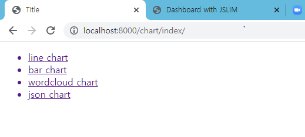
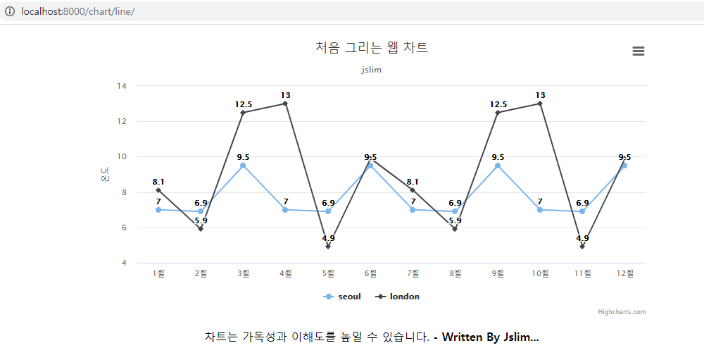
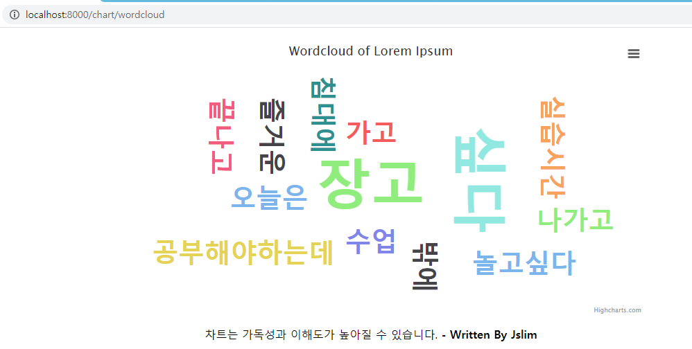
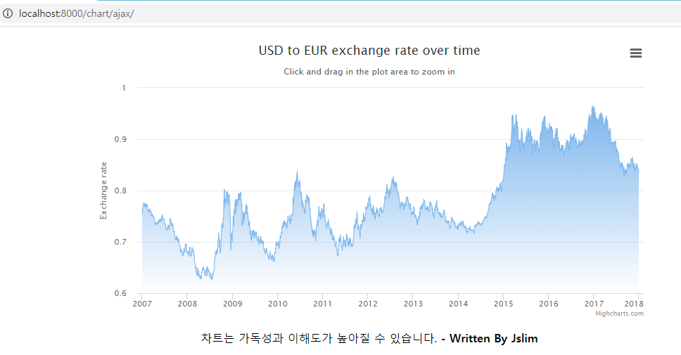

# django

2020-09-24

__학습 내용__

> django - visualization(시각화) - script(json)
>
> script - jquery , d3 , google chart, __highchart__
>
> 비정형 데이터 - dataframe(pandas) - (.csv) - model (class)
>
> * render / HttpResponse 는 새로고침 할때 마다 터미널에 반영된다.
>
> chart -> line, bar, wordcloud, json 차트 종류를 그려보았다.

---------------------------------------------------------------------------------------


## Chart

> __ChartApp__ 새로운 어플 생성
>
> python manage.py startapp ChartApp 
>
> settings에 추가 
>
> djangoWEB urls에 App넣어주기


__ChartApp.urls__

```python
from django.urls import path, include
from ChartApp import views

# path의 첫번째는 url경로
urlpatterns = [
    path('index/', views.intro,name='index'),
    path('line/', views.line, name='line'),
    path('bar/', views.bar, name='bar'),
    path('wordcloud', views.wordcloud, name='wordcloud'),
    path('ajax/', views.ajax,name='ajax')
    ]
```

__ChartApp.views__

```python
from django.shortcuts import render

# Create your views here.

def intro(request):
    return render(request, 'chart_index.html')

def line(request):

    seoul = [7.0, 6.9, 9.5, 7.0, 6.9, 9.5, 7.0, 6.9, 9.5, 7.0, 6.9, 9.5]
    london = [8.1, 5.9, 12.5, 13.0, 4.9, 9.9, 8.1, 5.9, 12.5, 13.0, 4.9, 9.9]

    context = {'seoul' : seoul, 'london' : london}
    return render(request,'chart_line.html',context)

def bar(request):
    Year_1800 = [107, 31, 635, 203, 2]
    Year_1900 = [133, 156, 947, 408, 6]
    Year_2000 = [814, 841, 3714, 727, 31]
    Year_2016 = [1216, 1001, 4436, 738, 40]

    context = {'Year_1800': Year_1800, 'Year_1900': Year_1900,'Year_2000': Year_2000,'Year_2016': Year_2016}
    return render(request, 'chart_bar.html',context)


def wordcloud(request):
    txt = '오늘은 즐거운 장고 실습시간 수업 끝나고 장고 공부해야하는데 침대에 가고 싶다 놀고싶다 밖에 나가고 싶다'
    context = {'txt' : txt }
    return render(request,'chart_wordcloud.html',context)


def ajax(request):
    return render(request, 'chart_ajax.html')
```


##### templates

__chart_index.html__

그래프를 그린 주소로 이동할수 있게 url을 연결하는 작업을 했다.

```html
<!DOCTYPE html>
<html lang="en">
<head>
    <meta charset="UTF-8">
    <title>Title</title>
</head>
<body>
    <ul>
        <a href="../line"><li>line chart</li></a>
        <a href="../bar"><li>bar chart</li></a> <!--여기서 a는 링크를 연결해줌-->
        <a href="../wordcloud"><li>wordcloud chart</li></a>
        <a href="../ajax"><li>json chart</li></a>
    </ul>

</body>
</html>
```



------------------------------------------------

#### 실습 결과

__Line Chart__

highchart사이트를 기반으로 하여 실제로 시각화를 해보는 작업을 했다.

* 그래프 코딩 예시

```html

<!--출처  : highcharts.com  -->

<body>
    <figure class = "highcharts-figure"> <!--이미지랑 텍스트를 가져올 수 있음 -->
        <div id = "container"></div>
        <p class="highcharts-description">
        <center>차트는 가독성과 이해도를 높일 수 있습니다.
        <b>- Written By Jslim... </b>
        </center>

        </p>

    </figure>
    <script>

        Highcharts.chart('container', {
            chart : { type : 'line' },
            title : { text : '처음 그리는 웹 차트' },
            subtitle : { text : 'jslim' },
            xAxis : {
                categories : ['1월','2월','3월','4월','5월','6월','7월','8월','9월','10월','11월','12월']
                }, // x축
            yAxis : {
                title : { text : '온도' }
            }, //y축
            plotOptions : {
                line : {
                dataLabels : { enabled : true }
                },
                enableMouseTracking : false
            },
            series : [
            { name : 'seoul',
              data : {{seoul}} // 데이터를 넣을 수 있음
             },
             { name : 'london',
              data :  {{london}}// 데이터를 넣을 수 있음
             }
             ]
             })

    </script>
</body>
```




__Bar_Chart__


__WordCloud_Chart__



__Json_Chart__





#### 실습 후 소감

>웹을 통해 시각화 해보았다. 내가 자주 사용하던 R 프로그램과는 다른 느낌을 주는 그래프를 그려 볼 수 있었다. 앞으로 프로젝트를 하게 되면 웹을 통해 그래프를 그려보는 기회를 준 계기가 된 수업인것 같다.

