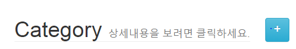
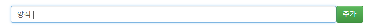
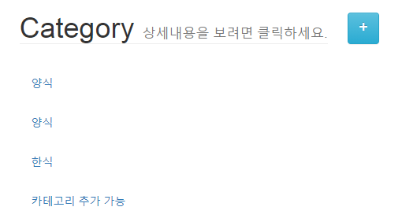
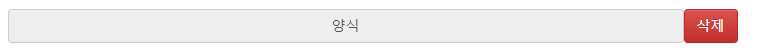
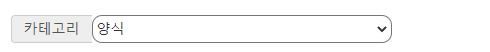
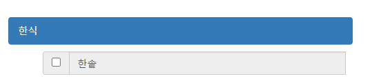
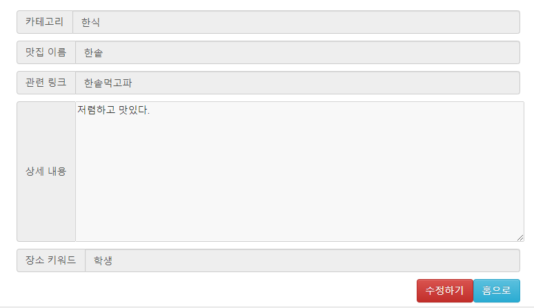
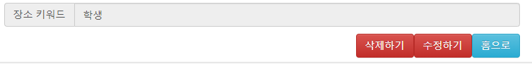

# django

2020-09-25

__[학습내용]__

django에서 배웠던 내용을 복습하기 위해 __"Django 한그릇 뚝딱"__ 이라는 책을 보고 이를 통해 복습 및 실습을 해보는 시간을 가지게 되었다.


출처 : https://github.com/doorBW/Django_with_PracticeExamples

-----------------------------------------

### RestaurantShare-with-Django


#### 1.1 프로젝트 및 app 구성하기

__1) 프로젝트 생성하기__

django-admin startproject RestaurantShare


__2) app 생성하기__

python manage.py startapp shareRes -> 기본적으로 웹 페이지의 전반적인 `CRUD`등을 처리

`CRUD` = Create. Read. Update. Delete

python manage.py startapp sendEmail -> 이메일을 발송하는 로직을 처리


__3) app들을 장고 프로젝트 `settings.py` 파일에 추가 __

```python
# Application definition

INSTALLED_APPS = [
    'django.contrib.admin',
    'django.contrib.auth',
    'django.contrib.contenttypes',
    'django.contrib.sessions',
    'django.contrib.messages',
    'django.contrib.staticfiles',
    'shareRes',
    'sendEmail'
]
```


#### 1.2 URL 및 템플릿 설정하기

__1) `RestaurantShare.urls.py` 에 url별로 각 app으로 처리 넘겨주기__

```python
from django.contrib import admin
from django.urls import path, include

urlpatterns = [
    path('admin/', admin.site.urls),
    path('',include('shareRes.urls')),
    path('sendEmail/',include('sendEmail.urls')),

]
```

__2) `sendEmail.urls.py` 에 url path 추가하기__

```python
from django.urls import path, include
from .import views

urlpatterns = [
    path('send/', views.sendEmail,name='send'),
    
]
```

__3) `sendEmail.views.py` 에서 sendEmail 함수를 만들어 주기__

```python
from django.shortcuts import render
from django.http import HttpResponse


# Create your views here.
def sendEmail(request):
    return HttpResponse('sendEmail')
```

__4) `shareRes app`에 urls 파일 생성후 url에 path 추가하기__

```python
from django.urls import path, include
from .import views

urlpatterns = [
    path('', views.index,name='index'),
    path('restaurantDetail/',views.restaurantDetail,name='restaurantDetail'),
    path('restaurantCreate/', views.restaurantCreate, name='restaurantCreate'),
    path('categoryCreate', views.categoryCreate, name='categoryCreate'),


]
```

__5) `shares.views.py` 에서 함수를 만들어 주고 templates에 있는 html 파일을 연결해주기__

```python
from django.shortcuts import render
from django.http import HttpResponse
# Create your views here.

def index(request):
    #return HttpResponse("index")
    return render(request,'index.html')

def restaurantDetail(request):
    #return HttpResponse("restaurantDetail")
    return render(request,'restaurantDetail.html')

def restaurantCreate(request):
    #return HttpResponse("restaurantDetail")
    return render(request, 'restaurantCreate.html')

def categoryCreate(request):
    #return HttpResponse("categoryCreate")
    return render(request,'categoryCreate.html')

```


#### 1.3 CRUD 구성하기

* [category에 대한 `CRUD` - __Create__]



__1) model 생성하기 __

```python
from django.db import models

# Create your models here.

# 데이터를 구분해주는 id값은 자동으로 생성되어짐
class Category(models.Model):
    category_name = models.CharField(max_length=100)
    
```

모델 생성후 -> python manage.py makemigrations -> python manage.py migrate

__2) categoryCreate/create에 맞는 urls 추가하기 __

```python
path('categoryCreate/create', views.Create_category, name='cateCreate'),
```

__3) `views.py`에 함수 추가하기__

```python
from django.shortcuts import render
from django.http import HttpResponse, HttpResponseRedirect
from django.urls import reverse
from .models import *

# 카테고리 추가에대한 함수 구현 (Create)
def Create_category(request):
    category_name = request.POST['categoryName'] 
    # 사용자가 입력한 문자열 값을 category_name 변수에 담기
    new_category = Category(category_name=category_name)  
    # 새로운 Category 모델에 대한 객체를 생성
    new_category.save()
    return HttpResponseRedirect(reverse('index')) 
	# reverse 함수를 통해 index라는 url을 찾게 한다. HttpResponseRedirect을 통해 하당 url로 이동

```




* [category에 대한 `CRUD` - __Read__] => category를 화면에서 확인할 수 있는 `read` 기능 구현하기

__1) `views.py`에 함수 추가하기__

데이터베이스에서 Category모델로 생성된 모든 데이터를 가져와서 html화면에 보여주어야한다. 따라서 `Category.model`로 생성된 모든 데이터를 가져오게 만들어야 한다. 

```python
# index 함수 수정 
def index(request):
    categories=Category.objects.all()
    content = {'categories' : categories}
    return render(request,'index.html', content)
```

`index.html` 에서 {% for category in categories $} ~{ % endfor %} 통해 for문 생성하기



* [category에 대한 `CRUD` - __Read__]

"+"버튼을 눌렀을때 나오는 categoryCreate화면에서도 목록이 나타나게 _함수 수정 및 html 수정_ 필요

```python
def categoryCreate(request):
    categories = Category.objects.all()
    content = {'categories' : categories}
    #return HttpResponse("categoryCreate")
    return render(request,'categoryCreate.html', content)
```

* [category에 대한 `CRUD` - __Delete__]

__1) categoryDelete/delete에 맞는 urls 추가하기 __

```python
path('categoryCreate/delete', views.Delete_category, name='cateDelete'),
```

__2) `views.py`에 함수 추가하기__

```python
# 카테고리 삭제하기(Delete)
def Delete_category(request):
    category_id = request.POST['categoryId']
    delete_category = Category.objects.get(id=category_id)
    delete_category.delete()
    return HttpResponseRedirect(reverse('categoryCreate'))
```



-------------------------------------

* [restaurant에 대한 `CRUD` - __Create__]

__1) 카테고리 드롭다운 형식 수정 - `views.py`__

```python
# restaurant 카테고리 드롭다운 형식으로 나타내기
def restaurantCreate(request):
    categories = Category.objects.all()
    content = {'categories':categories}
    #return HttpResponse("restaurantDetail")
    return render(request, 'restaurantCreate.html', content)
```

```html
<!--html 수정 restaurantCreate.html-->
<select id="resCategory" name="resCategory" class="resCategory" size="1" required autofocus>
                            
                             <!--디폴트로 기본양식이 보이게 정의 -->
                            <option value="{{category.id}}" selected>{{category.category_name}}</option>
                             <!--선택한 값들 정의 -->
                            <option value="{{category.id}}">{{category.category_name}}</option>
                            
                            
                        </select>
```



__2) `models.py`에서 모델 생성__

```python
class Restaurant(models.Model):
    category = models.ForeignKey(Category, on_delete=models.SET_DEFAULT, default= 5)
    restaurant_name = models.CharField(max_length=100)
    restaurant_link = models.CharField(max_length=500)
    restaurant_content = models.TextField()
    restaurant_keyword = models.CharField(max_length=50)
```

restaurant 모델이 데이터베이스에 반영됨 -> __"맛집 추가!"__ `Create`를 하기위해 html값에서 form태그에 action의 값을 추가해주어야 한다. 

__3) `urls`에 path 추가__ 

```python
path('restaurantCreate/create', views.Create_restaurant, name='resCreate'),
```

__4) `views.py` 에서 함수 생성하기__

```python
# 맛집 추가하기 (Create)
def Create_restaurant(request):
    category_id = request.POST['resCategory']
    category = Category.objects.get(id=category_id)
    name = request.POST['resTitle']
    link = request.POST['resLink']
    content = request.POST['resContent']
    keyword = request.POST['resLoc']
    new_res = Restaurant(category=category, restaurant_name = name, restaurant_link=link, restaurant_content=content, restaurant_keyword = keyword)
    new_res.save()
    return HttpResponseRedirect(reverse('index'))
```


* [restaurant에 대한 `CRUD` - __Read__]

__1) `views.py` 에서 함수 생성하기__

추가된 맛집들을 사용자가 보기위해 Read구현이 필요하다. 

```python
def index(request):
    categories = Category.objects.all()
    restaurants = Restaurant.objects.all()
    content = {'categories' : categories,'restaurants':restaurants}
    return render(request,'index.html', content)
```

__2) `index.html` 를 통해 시각적으로 보여주기__

```html

                            <li class = "category deactive">{{category.category_name}}</li>
                            <ul class="restaurantList">

                                { % for restaurant in restaurants %}
                                { % if restaurant.category == category % }
                                <div class ="input-group">
                                    <span class = "input-group-addon">
                                        <input name="checks" id="check{{restaurant.id}}" type="checkbox" value="{{restaurant.id}}">
                                    </span>
                                    <a href="restaurantDetail/{{restaurant.id}}">
                                        <input name="res{{restaurant.id}}" id="res{{restaurant.id}}"
                                                                        type="text" class="form-control" disabled style="cursor:
                                                                        pointer;" value="{{restaurant.restaurant_name}}"></a>
                                </div>
                                { % endif % }
                                { % endfor % }

                            </ul>
                            
```



Read에서 레스토랑을 클릭하면 상세페이지로 이동하게 하는 작업

__1) `urls.py` 에서 추가 설정__

```python
path('restaurantDetail/<str:res_id>',views.restaurantDetail,name='resDetailPage'),
# 이때 /<str:res_id> 동적인 값을 의미 : 기준으로 좌측 -> 어떤 데이터 타입으로 받을지 결정
								# 			우축 -> 어떤 이름으로 받을지 결정
```

__2) `views.py` 에서 함수 생성하기__

```python
def restaurantDetail(request,res_id):
    restaurant = Restaurant.objects.get(id = res_id)
    content = {'restaurant': restaurant}
    #return HttpResponse("restaurantDetail")
    return render(request,'restaurantDetail.html',content)
```

__3) `restaurantDetail.html` 에서 정보를 직접적으로 보여주기 위해 수정이 필요하다__


* [restaurant에 대한 `CRUD` - __Update__]

__1) `restaurantDetail.html` 수정하기 버튼 추가 __

```html
<a href ="./updatePage/{{restaurant.id}}" class="resAddBtn btn btn-danger" role="button">수정하기</a>
```



__2) `urls.py` 수정하기 연결을 위해 추가 __

```python
path('restaurantDetail/updatePage/<str:res_id>',views.restaurantUpdate,name='resUpdatePage'),
```

__3) `views.py` 에서 함수 생성하기__

```python
def restaurantUpdate(request,res_id):
    categories = Category.objects.all()
    restaurant = Restaurant.objects.all(id = res_id)
    content = {"categories":categories, "restaurant" : restaurant}
    return render(request, 'restaurantUpdate.html', content)
```

__4) `restaurantUpdate.html` 수정하기__

__5) `urls.py` 수정하기 연결을 위해 추가 및 views.py 함수 생성 __

```python
path('restaurantDetail/updatePage/update',views.Update_restaurant,name='resUpdate'),
```

```python
# 맛집 수정하기 (Update)
def Update_restaurant(request):
    resId = request.POST['resId']
    change_category_id = request.POST['resCategory']
    change_category = Category.objects.get(id=change_category_id) # 사용자가 선택한 카테고리 id값에서 실제 카테고리데이터를 가져온다.
    change_name = request.POST['resTitle']
    change_link = request.POST['resLink']
    change_content = request.POST['resContent']
    change_keyword = request.POST['resLoc']
    before_restaurant = Restaurant.objects.get(id=resID)
    before_restaurant.category = change_category
    before_restaurant.category=change_category
    before_restaurant.restaurant_name=change_name
    before_restaurant.restaurant_link=change_link
    before_restaurant.restaurant_content=change_content
    before_restaurant.restaurant_keyword=change_keyword
    before_restaurant.save()
    return HttpResponseRedirect(reverse('resDetailPage',kwargs={'res_id':resId}))
```


* [restaurant에 대한 `CRUD` - __Delete__]

__1) `restaurantDetail.html` 삭제하기 버튼 추가 __

```html
<form action="./delete" method="POST">
                <input type="hidden" id="resId" name="resId" value="{{restaurant.id}}"/>
                    <input type="submit" class="resAddBtn btn btn-danger" value="삭제하기">
                </form>
```



__2) `urls.py` 삭제연결을 위해 추가 __

```python
path('restaurantDetail/delete', views.Delete_restaurant, name='resDelete'),
```

__3) `views.py` 에서 함수 생성하기__

```python
# 맛집 삭제하기 (Delete)
def Delete_restaurant(request):
    res_id = request.POST['resId']
    restaurant = Restaurant.objects.get(id=res_id)
    restaurant.delete()
    return HttpResponseRedirect(reverse('index'))
```

